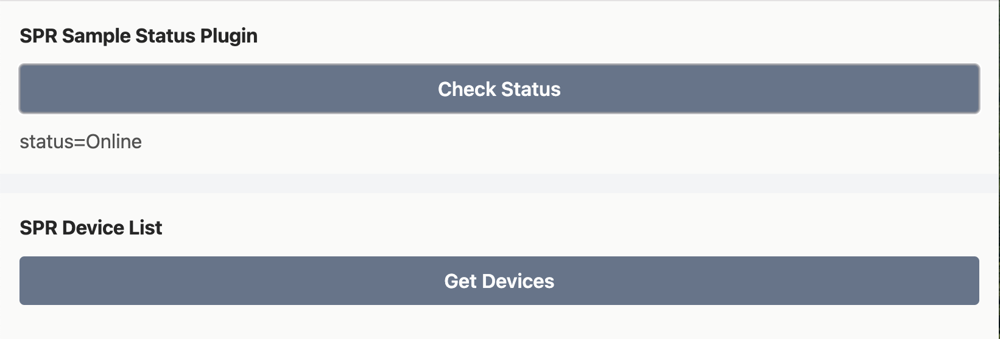

# SPR custom plugin ui template

The ui for custom plugins use create-react-app & glustack, see [deps](package.json#L5).
Check [Dockerfile](Dockerfile) if you want to dev in docker.

```sh
PORT=8080 npm start
```

Visit [http:localhost:8080](http:localhost:8080) or click _Start dev mode_ under _Custom Plugin_ (under _System_ -> _Plugins_) in SPR ui.



Read more in the [API documentation](https://www.supernetworks.org/pages/api/0).

**NOTE** need to pass a token if you want to talk to the spr api from your plugin in dev mode.
Add a token in the spr ui under _System -> Auth_ and pass it with _REACT_APP_TOKEN_ environment variable.

## dev mode

```sh
export REACT_APP_TOKEN="SPR-TOKEN-HERE"
PORT=8080 npm start
```

### Docker version in dev mode with token
```sh
docker build -t spr-plugin-ui:latest .
export REACT_APP_TOKEN="SPR-TOKEN-HERE"
docker run --rm -ti -p 8080:3000 -e "REACT_APP_TOKEN=$REACT_APP_TOKEN" spr-plugin-ui
```

In SPR ui navigate to _Plugins_, press _Custom Plugin_ & connect to verify.

## dev mode with spr on localhost:

```sh
export REACT_APP_API="http://localhost:3000"
export REACT_APP_TOKEN="SPR-TOKEN-HERE"
PORT=8080 npm start
```

## build

```sh
npm run build
```

when everything is done & working you can build & push it to spr

# Examples

How to get a list of all devices from ui in my plugin?

```js
import { api } from './API'
//...
let devices = await api.get('/devices')
console.log('devices=', devices)
```

See example in [src/examples](src/examples/):
* [Status](src/examples/Status.js)
* [List Devices](src/examples/Devices.js)
