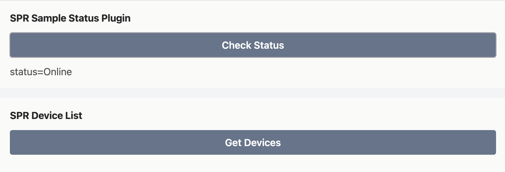

# SPR custom plugin with ui template

This is a sample plugin for spr, including:

- basic api
- frontend for the api
- build for docker-compose and Dockerfile

## Steps to create a new plugin

- clone this repo
- name your plugin
- edit [plugin.json](plugin.json)

# Build

test a local build of your plugin in docker:

```sh
export DOCKER_BUILDKIT=1
docker-compose build
mkdir -p state/plugins/sample_plugin
docker-compose up -d
curl --unix-socket ./state/plugins/sample_plugin/socket http://localhost/test
curl --unix-socket ./state/plugins/sample_plugin/socket http://localhost/index.html
```

# Frontend - UI Code

The ui for custom plugins use create-react-app & glustack, see [deps](package.json#L5).
Check [Dockerfile](Dockerfile) if you want to dev in docker.

```sh
REACT_APP_TOKEN= REACT_APP_API= PORT=8080 npm start
```

Visit [http:localhost:8080](http:localhost:8080) or click _Start dev mode_ under _Custom Plugin_ (under _System_ -> _Plugins_) in SPR ui.



Read more in the [API documentation](https://www.supernetworks.org/pages/api/0).

**NOTE** need to pass a token if you want to talk to the spr api from your plugin in dev mode.
Add a token in the spr ui under _System -> Auth_ and pass it with _REACT_APP_TOKEN_ environment variable.
Define SPR API url using the _REACT_APP_API_ environment variable.

## Dev mode

```sh
export REACT_APP_TOKEN="SPR-TOKEN-HERE"
export REACT_APP_API="http://spr.local" # SPR IP
PORT=8080 npm start
```

The ui will setup a connection to provided API using the token for auth. These will be populated automatically for your plugin when built, _make sure there are no hardcoded URL's or tokens in your repo_.

### Docker version in Dev mode with token

```sh
docker build -t spr-plugin-ui:latest .
export REACT_APP_TOKEN="SPR-TOKEN-HERE"
export REACT_APP_API="http://spr.local"
docker run --rm -ti -p 8080:3000 -e "REACT_APP_TOKEN=$REACT_APP_TOKEN" spr-plugin-ui
```

In SPR ui navigate to _Plugins_, press _Custom Plugin_ & connect to verify.

## Dev mode with spr on localhost

```sh
export REACT_APP_API="http://localhost:8000"
export REACT_APP_TOKEN="SPR-TOKEN-HERE"
PORT=8080 npm start
```

## Build

```sh
npm run build
```

when everything is done & work, push it to spr plugin repo

## Install

Drop the github repo url into "Add Plugin from URL" view under Plugins.

# Examples

How to get a list of all devices from ui in my plugin?

```js
import { api } from './API'
//...
let devices = await api.get('/devices')
console.log('devices=', devices)
```

See example in [src/examples](src/examples/):

- [Status](src/examples/Status.js)
- [List Devices](src/examples/Devices.js)

# TODO

- show complete flow for building a plugin, including ui
- add another sample repo with js only

building in plugin directory should also take care of ui, smtg like this:

```bash
if [ -d "frontend"]; pushd frontend && npm run build && popd && cp -a frontend/build web; fi
```

(but use a separate Dockerfile for this)

for building/serving plugin web code:

- docker build will use build Dockerfile here & run `npm run build` web ui into plugin web/
- on fs: plugins/plugin-x/web - same for web
- this is linked from plugin json config, set key `Web: true`
- web ui bundle is served @ /plugins/plugin-x/web as static
